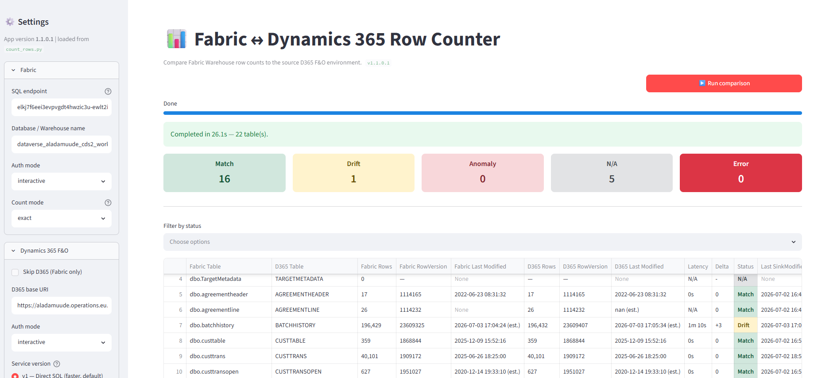

# Fabric ↔ Dynamics 365 Row Count & Latency Demo

> ⚠️ **This is a demonstration / sample.** It is intentionally small, opinionated,
> and not production-ready. Customers and partners are **expected to adopt,
> adapt and enhance** it (auth flow, error handling, scheduling, telemetry,
> branding, etc.) to fit their environment and policies. The author and
> Microsoft provide no warranty and no support — see the [Disclaimer](#disclaimer).

A small toolkit that compares **row counts** between a Microsoft Fabric
warehouse (typically the destination of a **Fabric Link** mirroring) and the
**Dynamics 365 Finance & Operations** source environment, then highlights any
**Match / Drift / Anomaly** so you can quickly spot where the mirrored data
diverges from the source.

In addition to row counts, the tool calculates **replication latency** —
estimated per table — by comparing the last-modified timestamp of the most
recently synced record in Fabric against the current time in D365 F&O. This
gives you an at-a-glance measure of **how far behind Fabric is** for each
table, even when an exact end-to-end latency cannot be directly observed.

## 🎬 Demo

https://github.com/user-attachments/assets/65890635-db23-4a5a-83ca-95b5f993e23b

<sub>If the inline player above doesn't render in your viewer, the raw video
file is at [`docs/Fabric-Dynamics365FO-RowCounterSmall.mp4`](docs/demo.webm).</sub>

<video src="docs/Fabric-Dynamics365FO-RowCounterSmall.mp4" controls width="720"></video>

### Current UI (v1.1.0.1)



---

## What's in this repo

| Path | What it is |
| ---- | ---------- |
| [`FabricCounter.axpp`](FabricCounter.axpp) | The X++ project that exposes the **`FabricHelperService`** custom service in D365 F&O. **Required** — the Python tools call this service. |
| [`fabric-row-counter/`](fabric-row-counter/) | The core Python **CLI** (`count_rows.py`) — Fabric ODBC + D365 service call + console / HTML / CSV output. |
| [`fabric-row-counter-ui/`](fabric-row-counter-ui/) | A **Streamlit web UI** that wraps the CLI in a friendly form with a sortable result grid and download buttons. |
| [`dist/FabricRowCounter-windows-x64.zip`](#option-a--pre-built-windows-app-no-python-install--easiest) | A pre-built, **self-contained Windows distributable** of the Streamlit UI (PyInstaller bundle). **Not stored in the repo** — published as a [GitHub Release](../../../releases) asset to keep the repo small. |
| [`docs/demo.webm`](docs/demo.webm) | Short screen recording of the Streamlit UI in action. |

---

## How it works

```
                   ┌────────────────────────┐
                   │  Dynamics 365 F&O      │
                   │  FabricHelperService   │  ◄── X++ project (FabricCounter.axpp)
                   │   v1: Direct SQL       │
                   │   v2: X++ count        │
                   └──────────┬─────────────┘
                              │ HTTPS (OAuth2)
                              │
   ┌──────────────────────────┴───────────────────────────┐
   │                Python tool (CLI or UI)               │
   │   1. Reads row counts from Fabric Warehouse (ODBC)   │
   │   2. Calls the D365 service for each table           │
   │   3. Computes delta and assigns Match / Drift / etc. │
   │   4. Writes timestamped HTML + CSV reports           │
   └──────────────────────────┬───────────────────────────┘
                              │ TDS / ODBC (Azure AD)
                              ▼
                   ┌────────────────────────┐
                   │  Fabric Warehouse      │
                   │  (Fabric Link sink)    │
                   └────────────────────────┘
```

Per-table verdicts:

| Status | Meaning |
| ------ | ------- |
| **Match**   | Fabric row count == D365 row count |
| **Drift**   | D365 has more rows (Fabric is lagging behind / missing rows) |
| **Anomaly** | Fabric has more rows than D365 (unexpected — should be investigated) |
| **N/A**     | Table doesn't exist in D365 (e.g. Dataverse-only tables) |
| **Error**   | Count could not be retrieved |

---

## Step 1 — Deploy the X++ service to D365 F&O

1. Open Visual Studio on your D365 F&O development VM.
2. **File → Import Project** and select [`FabricCounter.axpp`](FabricCounter.axpp).
3. Build the model and **Database synchronize**.
4. Deploy to a Tier-1 / Tier-2 sandbox.
5. Verify the service group `FabricHelperServiceGroup` and the service
   `FabricHelperService` appear under **AOT → Services**.

📚 Microsoft documentation on importing `.axpp` projects:
- [Create models and projects](https://learn.microsoft.com/dynamics365/fin-ops-core/dev-itpro/dev-tools/models)
- [Import and export projects (.axpp)](https://learn.microsoft.com/dynamics365/fin-ops-core/dev-itpro/dev-tools/import-export-project-vs)
- [Custom services overview](https://learn.microsoft.com/dynamics365/fin-ops-core/dev-itpro/data-entities/services-home-page)

The service exposes two operations:

| Operation | Backend | When to use |
 | --------- | ------- | ----------- |
 | `getTableRecordCount` ⭐ **default** | Direct SQL `COUNT(*)` against AxDB | **Preferred** — fastest, no X++ overhead. Use this in normal operation. |
 | `getTableRecordCountV2` | X++ `select crossCompany count(RecId) from <Table>` | **Edge-case fallback only** — uses the same code path as Fabric Link. Switch to this only when V1 shows a persistent Anomaly and you need to rule out orphan-row noise. |
 
 > **V1 is the recommended default.** It is significantly faster and sufficient
 > for the vast majority of reconciliation use-cases.
 >
 > **When to switch to V2:** The direct SQL count includes **orphan records** —
 > rows that still exist physically but belong to a **removed legal entity
 > (DataAreaId)**. Fabric Link skips those rows because it goes through the
 > X++ kernel. If you see a small, persistent **Anomaly** with V1 that you
 > cannot explain by recent data changes, run V2 to confirm whether it is real
 > drift or just orphan rows being counted.

Request body:
```json
{ "_request": { "TableName": "CUSTTABLE", "RequestId": "any-id" } }
```
> `FabricLastSysRowVersion` (optional `int64`) can be added to the request body when the Fabric table has no `MODIFIEDDATETIME` column. D365 uses it to resolve the modification time of the record last synced to Fabric.

Response:
```json
{
  "Success": true,
  "Timestamp": "2026-04-29T08:08:42Z",
  "Message": "Record count retrieved successfully",
  "TableName": "CUSTTABLE",
  "RequestId": "any-id",
  "RecordCount": 72459,
  "LastSysRowVersion": 9876543210,
  "LastModifiedDateTime": "/Date(1745916522000)/",
  "IsEstimated": false,
  "FabricSyncedModifiedDateTime": "/Date(1745913000000)/",
  "IsFabricSyncEstimated": false
}
```

> `IsEstimated: true` means the D365 table has no `MODIFIEDDATETIME` column; the timestamp is an estimate.
> `FabricSyncedModifiedDateTime` / `IsFabricSyncEstimated` are only populated when `FabricLastSysRowVersion` was included in the request; same logic applies.

### 🔧 Customizing the service name

If you choose to deploy the service under a **different name** (different
service group, service, or operation name), you must update one line in the
Python script. Open
[`fabric-row-counter/count_rows.py`](fabric-row-counter/count_rows.py)
and locate the `d365_count` function (around line 258):

```python
op = "getTableRecordCount" if service_version == "v1" else "getTableRecordCountV2"
url = f"{base_uri}/api/services/FabricHelperServiceGroup/FabricHelperService/{op}"
```

Replace `FabricHelperServiceGroup`, `FabricHelperService` and/or the operation
names to match what you deployed. Save the file — both the CLI and the UI pick
up the change automatically (the UI imports `count_rows.py` as a library).

If you also rebuild the prebuilt EXE in `dist/`, see
[`fabric-row-counter-ui/build.ps1`](fabric-row-counter-ui/build.ps1).

---

## Step 2 — Pick how you want to run it

You have **three** options. Pick whichever fits your audience.

### Option A — Pre-built Windows app (no Python install) ⭐ easiest

1. Go to the [**Releases**](../../../releases) page of this repository and
   download **`FabricRowCounter-windows-x64.zip`** from the latest release.
2. Unzip anywhere.
3. (One-time) Install **ODBC Driver 18 for SQL Server**:
   ```powershell
   winget install --id Microsoft.msodbcsql.18
   ```
   Or download manually: <https://learn.microsoft.com/sql/connect/odbc/download-odbc-driver-for-sql-server>
4. Double-click **`FabricRowCounter.exe`** — your default browser opens at
   <http://localhost:8501> with the UI.
5. Fill in the sidebar (Fabric endpoint, database, D365 URI), click **▶ Run comparison**.

> **Maintainers:** to rebuild the ZIP, run
> [`fabric-row-counter-ui/build.ps1`](fabric-row-counter-ui/build.ps1) and
> attach the resulting `dist\FabricRowCounter\` folder (zipped) to a new
> GitHub Release.

### Option B — Streamlit UI from source

For developers who want to tweak the UI.

```powershell
cd fabric-row-counter-ui
.\install.ps1     # creates .venv and installs dependencies
.\run.ps1         # launches Streamlit
```

See [`fabric-row-counter-ui/README.md`](fabric-row-counter-ui/README.md) for
detail.

### Option C — Command line only

For automation / CI.

```powershell
cd fabric-row-counter
.\install.ps1
Copy-Item .env.example .env
notepad .env       # fill in Fabric endpoint, database, D365 URI, etc.
.\.venv\Scripts\python.exe count_rows.py
```

See [`fabric-row-counter/README.md`](fabric-row-counter/README.md) for the
full list of environment variables (auth modes, table filters,
`D365_SERVICE_VERSION`, output paths, etc.).

---

## Prerequisites (all options)

- A **Fabric Warehouse** that mirrors data from D365 F&O via **Fabric Link**
  (or any equivalent path). You'll need its **SQL connection string** and the
  warehouse / database name.
- A **D365 F&O environment** with the `FabricHelperService` deployed
  (see Step 1).
- Azure AD identity (interactive user **or** service principal) with read
  access to both the Fabric warehouse and the D365 service.
- **ODBC Driver 18 for SQL Server** on the machine running the tool.
- For Options B & C only: **Python 3.10+**.

---

## Sample output

| Fabric Table        | D365 Table      | Fabric Rows | Fabric RowVersion | Fabric Last Modified | D365 Rows | D365 RowVersion | D365 Last Modified  | Latency  | Delta | Status | Last SinkModifiedOn |
| ------------------- | --------------- | ----------: | ----------------: | -------------------- | --------: | --------------: | ------------------- | -------- | ----: | ------ | ------------------- |
| dbo.custtable       | CUSTTABLE       |      72,444 |    9,876,543,100  | 2026-04-28 14:44:00  |    72,444 |  9,876,543,210  | 2026-04-28 14:45:00 | 1m 0s    |     0 | Match  | 2026-04-28 14:46:52 |
| dbo.custinvoicejour | CUSTINVOICEJOUR |      14,555 |    9,876,501,100  | 2026-04-29 08:53:00  |    14,555 |  9,876,501,234  | 2026-04-29 08:54:10 | 1m 10s   |     0 | Match  | 2026-04-29 08:55:27 |
| dbo.batchhistory    | BATCHHISTORY    |     293,809 |    9,876,498,900  | 2026-04-29 16:35:00  |   294,016 |  9,876,499,001  | 2026-04-29 16:38:00 | 3m 0s    |  +207 | Drift  | 2026-04-29 16:40:26 |
| dbo.bot             | BOT             |          40 |                 – | –                    |         – |               – | –                   | N/A      |     – | N/A    | 2026-04-28 09:09:55 |

> **Latency** is `D365 Last Modified − Fabric Last Modified` — how far behind the Fabric mirror is relative to the most recent D365 change.
> Both **Fabric Last Modified** and **D365 Last Modified** may show `(est.)` when `MODIFIEDDATETIME` is not available and a value is estimated.

A timestamped **HTML report** and **CSV** are written next to the script /
exe on every run.

---

## Disclaimer

This project is provided **as-is, for demonstration purposes only**. It is
not a Microsoft product, it is not officially supported, and it makes no
guarantees of correctness, completeness, or fitness for any particular
purpose. Customers and partners are **encouraged to fork, adapt, harden and
extend** the code to meet their requirements (CI/CD, telemetry, secrets
management, RBAC, productionalisation, etc.).

Use at your own risk.

---

## License

MIT — see [LICENSE](LICENSE).
